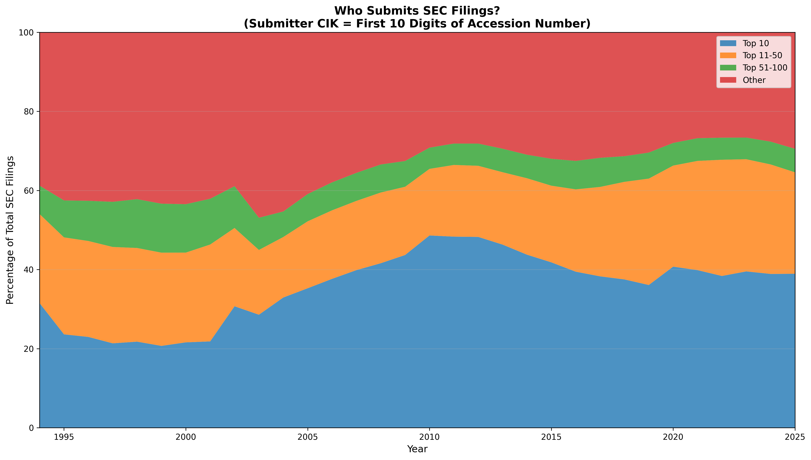
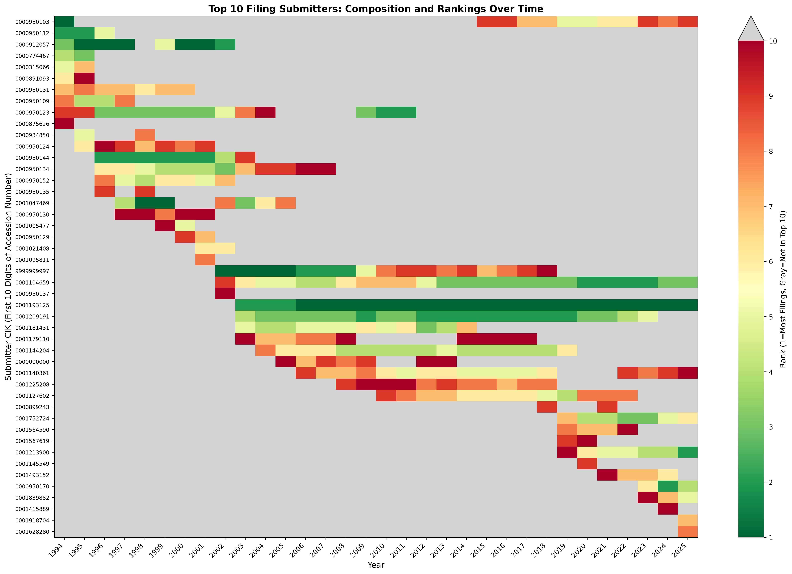
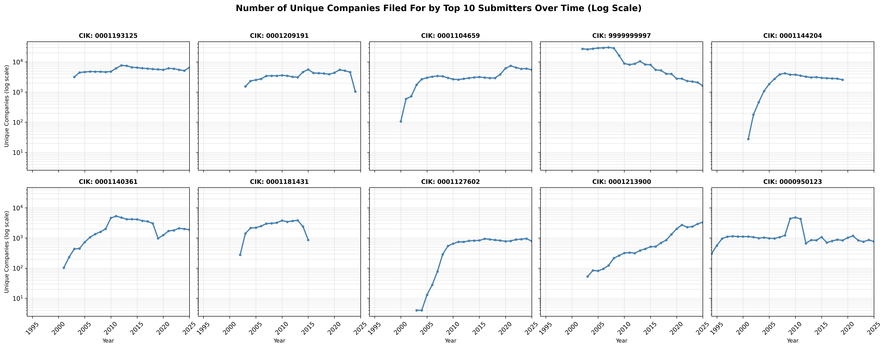

# Who Submits SEC Filings Over Time

The first ten digits of a filing's accession number is the cik of the entity that filed the filing. This is useful for getting [sec filings faster](https://github.com/john-friedman/The-fastest-way-to-get-SEC-filings).

> Confusingly this is different than the filer's cik. For example, Tesla's cik is 0001318605, the same as its filer cik. The entity that submitted the filing's cik is 0000950170. I'm not sure what company has cik 0000950170, as companies that file filings don't have listings. https://www.sec.gov/Archives/edgar/data/950170/ is empty, https://www.sec.gov/Archives/edgar/data/0001318605/ is not.

## Graphs

